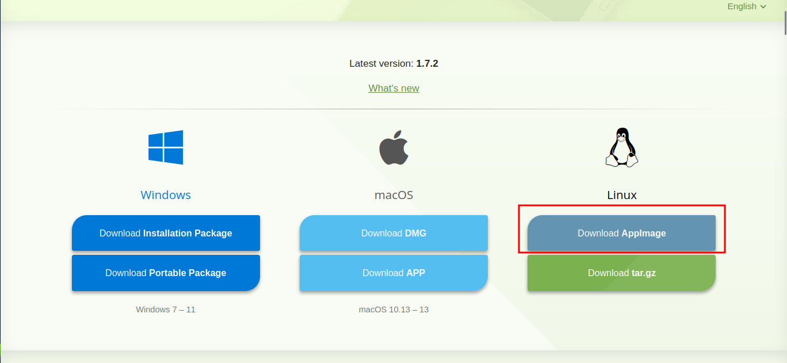
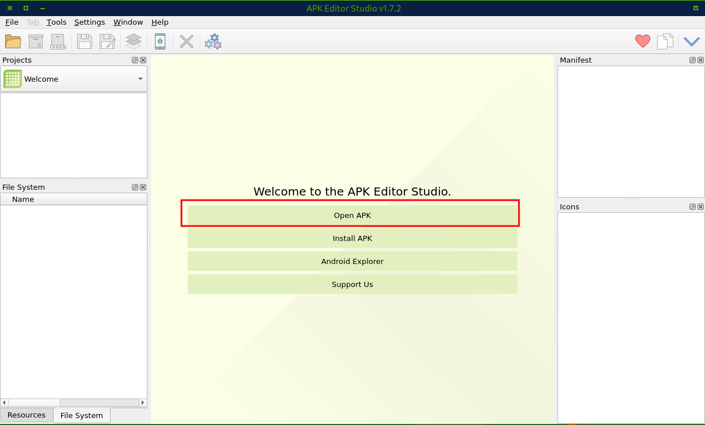
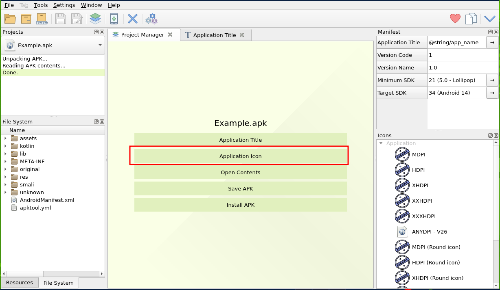
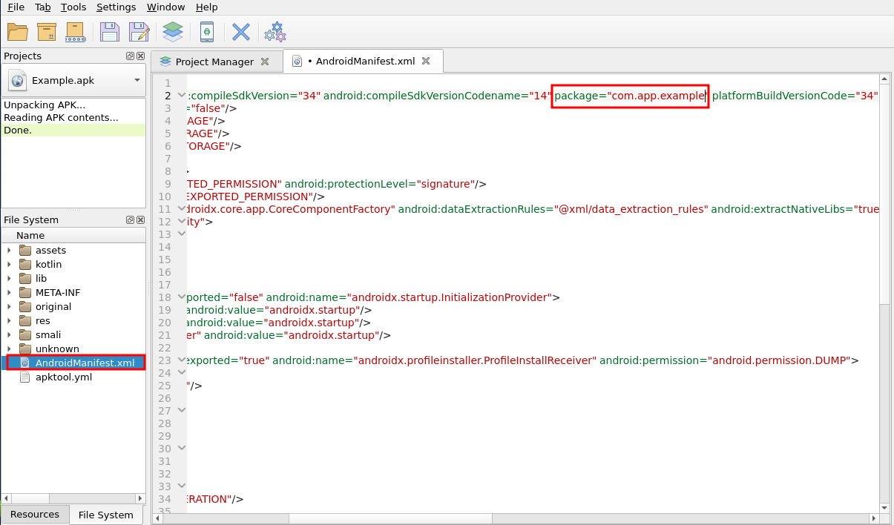
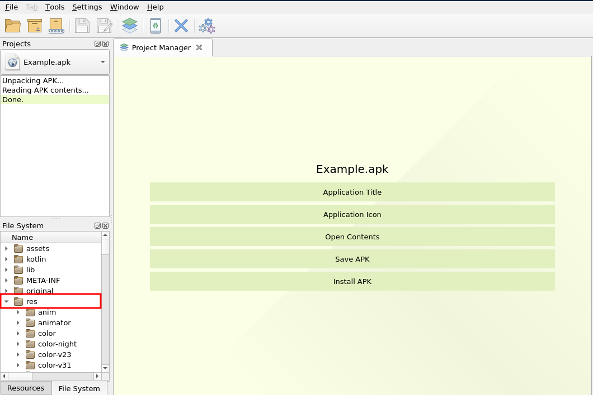
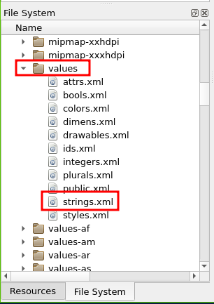
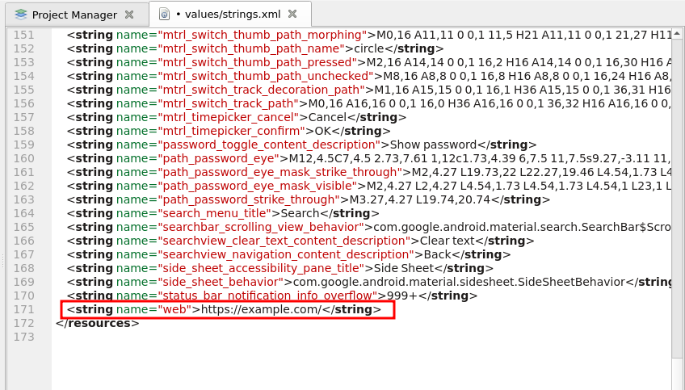

# Complete Guide to Editing APK Files

## Introduction

This comprehensive guide will walk you through modifying key elements of Android APK files using APK Editor Studio. You'll learn how to:

- Change application name
- Modify application icon
- Edit package identifier
- Update important strings in strings.xml

We'll focus on Windows and Linux platforms, with Android instructions coming in a future update.

> Note: Download Example App from [Here](Example_App.apk)

## Installation Guide

### Windows Installation

1. Visit [official download page](https://qwertycube.com/apk-editor-studio/download/)
2. Download the Windows executable (.exe) file
3. Run the installer and follow on-screen instructions
4. Launch APK Editor Studio from Start Menu

### Linux Installation

1. Download the .AppImage file from the official website
2. Open Terminal in the download directory
3. Make the file executable:
   `chmod +x APK-Editor-Studio*.AppImage`
4. Launch using:
   `./APK-Editor-Studio*.AppImage`

> Note: Some Linux distributions may require installing `fuse` libraries for AppImage support

## Editing APK Files

### Initial Setup

1. Launch APK Editor Studio
2. Click "Open APK" from Project Manager
3. Select your target APK file
4. Wait for automatic decompilation

### Modifying App Name

1. In Project Manager panel, click "Application Title"
2. Enter new name in the text field
3. Press Enter to confirm changes
4. Press `Ctrl + S` to Save changes

### Changing Application Icon

1. Click "Application Icon" in Project Manager
2. Choose "Import New Icon"
3. Select PNG file (recommended 512x512px)
4. Confirm replacement in dialog

### Updating Package ID

1. In File Explorer (bottom-left), double-click AndroidManifest.xml
2. Locate `package="..."` attribute
3. Edit using reverse domain format (com.example.newapp)
4. Save changes (Ctrl+S)

### Editing Strings.xml

1. In File Explorer, expand `res` directory

2. Navigate to `values` > `strings.xml`

3. Find `client_name` string and modify

4. Scroll to `web` string and update URL
5. Save changes (Ctrl+S)

## Finalizing Changes

1. Click "Save APK" in Project Manager
2. Choose output location
3. Wait for packaging and signing (5-15 minutes)
4. Test modified APK on device or emulator

> Important: Always test modified APKs thoroughly before distribution

## Editing on Android

Coming Soon

## Conclusion

You've now learned essential APK modification techniques using APK Editor Studio. Remember that:

- Package IDs must be unique for Play Store submissions
- Icons should follow Material Design guidelines
- Always maintain XML formatting when editing files
